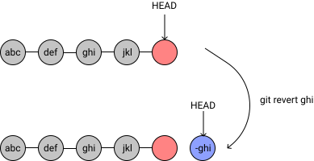
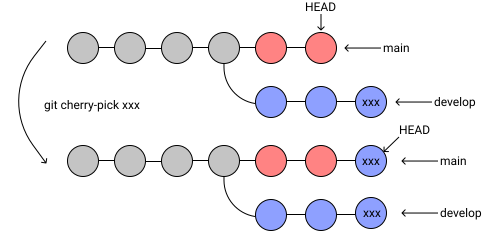

<!--
headingDivider: 2
-->

<!--
class: slides
-->

# git講習会(応用編)


<!--
_class: title
-->

### @hijiki51


#  @hijiki51

<!--
_class: user
-->

- 物理学系二年
- SysAd/Game
  
## 内容
- 時々使うgitコマンド紹介
  - revert/reset
  - merge
  - rebase
  - cherry-pick

- githubの便利な機能紹介
- アンチパターン集


## revert
**今回はよく使う用法のみ紹介します**
```
git revert <commit>
```
### 効果
- 指定されたcommitを打ち消すcommitが生成されます
- commitを取り消すときによく使います


## reset
```
git reset [--soft|--mixed|--hard] <commit>
```

### 効果
- 指定されたcommitまでtreeの状態を巻き戻します
- `--soft`
  - HEADの位置のみ指定commitに移動します
- `--mixed`
  - HEADの位置とindex(addされたファイル)を指定commitに移動します


## reset
```
git reset [--soft|--mixed|--hard] <commit>
```

### 効果

- `--hard`
  - HEADの位置、indexおよびワーキングツリー(addされていないファイル)も指定commitに移動します


## reset/revertの違い

### reset


## reset/revertの違い
### revert

## merge

```
git merge <commit>
```


## rebase

```
git rebase <commit>
git rebase --onto <commit> <commit> <commit>
```


## cherry-pick

```
git cherry-pick <commit>
```




## git**hub**の機能紹介
- branch protection
- github actions


## branch protection

- Require a pull request before merging
  - mergeする前にpull requestを作成する必要がある
  - オプションとしてapproveしないとmergeできなくできる
- Require status checks to pass before merging
  - mergeする前にstatus checkを通す必要がある

## github actions
- githubのCI/CD環境
- CI
  - Continuous Integration
  - 自動テストなどを指す
- CD
  - Continuous Delivery/Deployment
  - 自動リリースなど常に本番環境にデプロイ出来る状態を指す(Delivery)
  - 本番環境に自動デプロイできる状態を指す(Deployment)


## Demo


## アンチパターン集
- バイナリをpushする
- 不必要なコードをコメントアウトする


## バイナリをpushする

- githubではrepositoryの上限は10GB
- そもそもgitはバイナリファイルを追跡できない
- LFS(Large File Storage)を使おう(1敗)


## 不必要なコードをコメントアウトする

- 変更履歴はgitで管理されている
  - 基本的に復元可能
- **無意味**


## 間に合いませんでした

- git flow
- commit object
- fast-forward
- HEADとbranch

